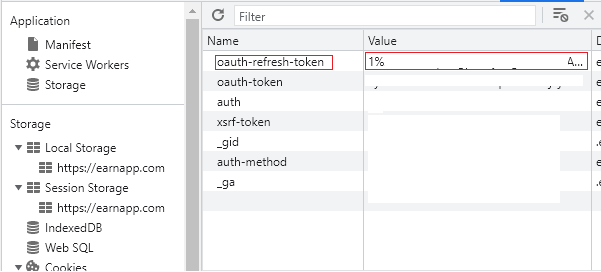

# apiEarnApp

Objectif, recuperer le montant earnApp

config yaml
```
- platform: apiEarnApp
  token: xxx
  scan_interval: 120
```

pour la recupération du token : 

ouvrir : https://earnapp.com/dashboard

et dans l'outil de developpement chrome

et recuperer le token : oauth-refresh-token

